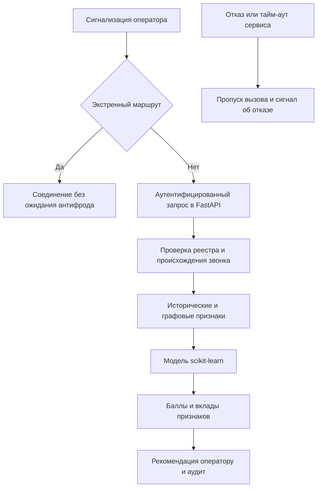

# Стратегия антифрода для телеком вызовов

## Цель и границы решения

Система оценивает риск вызова и текущее поведение номера по метаданным сигнализации и истории соединений. Она возвращает понятные факторы риска и рекомендацию оператору. Записи разговоров, расшифровки, текст сообщений и содержание речи не собираются и не принимаются API.

Основной критерий качества — доля ложных тревог на легитимных вызовах. Автоматическое прекращение связи не следует из высокого балла. В реализованном прототипе блокировка отсутствует: `auto_block` всегда равен `false`, а `review` означает проверку оператором без прерывания вызова. Риск номера не является утверждением о виновности его владельца.

Основа требований — предоставленный кейс Nexign «Антифрод без прослушки». Описание политической или регуляторной ситуации в исходном документе не использовано как проверенный юридический факт. Предлагаемые правила эксплуатации ниже — проектные решения, которые оператор должен согласовать перед внедрением.

## Стек и архитектура

Используется заданный стек: Python, scikit-learn, NetworkX, FastAPI. Выбран допустимый вариант scikit-learn; CatBoost не требуется одновременно. SQLite из стандартной библиотеки Python хранит локальную историю, заявки организаций и аудит. Это вспомогательное хранилище прототипа, а не замена обязательным компонентам.

Первый обход экстренной маршрутизации должен находиться у оператора до обращения к HTTP API. В приложении реализована дополнительная независимая проверка, которая не обращается к модели, истории или реестру. HTTP API сам по себе не обеспечивает доступность телефонной сети и не реализует её маршрутизацию.

## Какие сведения поступают на вход

Для текущего вызова доступны идентификатор, время начала с часовым поясом, вызывающий и вызываемый номера, псевдонимный идентификатор абонента, страна и оператор источника, входящий транк, регион назначения, тип соединения, подтверждение источника и признак экстренного маршрута от оператора.

Для завершённых вызовов дополнительно поступают время окончания, момент получения записи, факт ответа и длительность разговора. Длительность текущего вызова не используется при решении на его старте. Доли коротких и неотвеченных рассчитываются только из уже завершённой и полученной истории. Запись, пришедшая позже момента оценки, не должна появляться в исторических признаках даже при более раннем времени самого звонка.

Текущая реализация рассматривает окно 24 часа и отдельное окно одного часа. История номера ограничивается текущим идентификатором абонента, чтобы переоформление номера не автоматически наследовало репутацию прежнего владельца. API требует часовой пояс; временные компоненты модели рассчитаны в UTC. Для промышленной версии необходимо добавить локальное время абонента из проверенных операторских данных.

Номер нормализуется в E.164, российский внутренний формат с начальной восьмёркой или точный трёхзначный сервисный код. Совпадение по суффиксу запрещено. Для синтетики используется недозваниваемый префикс `test:`. Число стран или оператор сам по себе не является основанием считать вызов мошенническим.

## Признаки и оценка номеров

| Группа | Реализованные признаки | Что они показывают |
| --- | --- | --- |
| Интенсивность | Вызовы за час, уникальные адресаты, регионы | Масштаб и география обзвона |
| Результат соединений | Доли коротких отвеченных, неотвеченных и завершившихся за секунду | Характер попыток соединения |
| Устойчивые контакты | Средняя длительность, доля повторных адресатов | Отличие повторного общения от массового поиска жертв |
| Граф NetworkX | Число номеров одного абонента, согласованный веер обзвона | Группы номеров со сходным поведением |
| Текущий контекст | Вход из-за рубежа, VoIP, подтверждение источника, время UTC | Дополнительные сигналы текущего соединения |

Граф связывает псевдоним абонента с номерами и номера с адресатами. Признак веера требует минимум трёх номеров, минимум пяти исторических вызовов на каждом, непересекающихся списков адресатов, активности в общем часовом интервале и сходных длительностей. Он не доказывает мошенничество: больница или колл-центр могут иметь похожий граф. Поэтому легитимные массовые обзвоны включены в тестовые данные.

Этот прототип ищет веер внутри одного известного абонента. Связи между разными абонентами и межоператорские кампании не реализованы; их следует добавить после проверки качества доступных идентификаторов и установления правил обмена данными.

`POST /v1/numbers/score` строит оценку номера на заданный момент. Он использует контекст последнего доступного вызова и исторические окна, а не пожизненный рейтинг. При отсутствии истории или менее пяти записей возвращается `insufficient_data` и `risk_score: null`. Неизвестный номер нельзя представлять как заведомо безопасный нулевой риск.

## Объяснимость

Модель — стандартизованная логистическая регрессия. Для признака `i` вычисляется `c_i = coefficient_i × (value_i − mean_i) / scale_i`. Затем `z = intercept + sum(c_i)` и `risk_score = 100 × sigmoid(z)`.

Ответ содержит исходное значение каждого признака, его русское описание, вклад, базовый уровень и итоговую сумму. Все вклады возвращаются, включая отрицательные, и сортируются по абсолютной величине. Сумма точно восстанавливает результат модели; экспорт JSON проверен против вычислений scikit-learn с допуском `1e-10`.

Единица вклада — логарифм отношения шансов, а не процентные пункты шкалы 0–100. Нельзя написать «+38 баллов за число вызовов», если это число не получено из соответствующей аддитивной модели. Интерфейс должен подписывать единицы и показывать общий балл отдельно.

Модель обучена на синтетике с весами классов. Её результат — индекс риска, а не откалиброванная вероятность мошенничества на сети. До эксплуатации нужны реальные размеченные данные и независимая проверка калибровки. Привилегия не уменьшает математический балл до нуля: она отдельно управляет политикой вызова. Для защищённого вызова синхронный скоринг пропускается, а оценку номера можно запросить отдельно.

## Обязательный вопрос в ТЗ о скорой помощи

**Что произойдёт, если ваша система заблокирует вызов скорой помощи?**

Это критический инцидент доступности связи. Требование к архитектуре — исключить блокировку экстренного маршрута антифродом независимо от риска вызывающего номера. Даже номер с подтверждёнными злоупотреблениями должен иметь доступ к экстренной службе. Исключение относится к назначению вызова и не даёт этому номеру привилегий при звонках другим людям.

Для демонстрационного российского плана набора защищены точные коды 101, 102, 103, 104 и 112. Дополнительно принимается признак `destination_service: emergency` от доверенного операторского шлюза для алиасов и преобразованных маршрутов. Оператор обязан поддерживать полный актуальный перечень для своей территории, роуминга, перенаправлений и используемого плана набора. Список в Python не является полным международным справочником.

Экстренный вызов не должен ожидать модель, базу, внешнюю проверку, CAPTCHA, согласование сотрудником или отправку журнала. При отказе API, ошибке валидации, недоступности сети или тайм-ауте шлюз продолжает соединение по собственной политике пропуска при отказе. API возвращает защищённый результат без синхронной записи в БД; событие должно быть асинхронно записано на операторском шлюзе. Эта интеграция и сетевой тайм-аут должны проверяться отдельно, они не реализованы внутри прототипа.

Если блокировка всё же произошла, дежурный оператор немедленно включает обход блокирующего компонента, восстанавливает маршрут, останавливает распространение ошибочной версии и проверяет доставку экстренных вызовов и обратных звонков. Далее сохраняет трассировку решений без содержания разговора, определяет причину и вводит регрессионный тест. Нельзя считать инцидент закрытым только после восстановления HTTP API: нужна проверка связи на уровне операторской инфраструктуры.

## Привилегированные номера общественно важных организаций

Предложение пользователя реализовано как реестр с проверкой. Организация может самостоятельно подать заявку на свой номер, но не может самостоятельно присвоить ему статус подтверждённого. Право на привилегию определяется назначением организации и проверенным контролем номера, а не её собственным описанием.

Процесс состоит из следующих действий:

1. Оператор регистрирует организацию и выдаёт ей отдельные реквизиты доступа. В прототипе это отдельный API-ключ и серверное сопоставление ключа с организацией.
2. Организация подаёт номер и обоснование через `/v1/privileges/requests`. Заявка получает статус `pending` и не влияет на скоринг.
3. Уполномоченный сотрудник проверяет полномочия представителя, общественно важное назначение, владение номером, идентификатор абонента, оператора и разрешённый транк. В API сохраняется ссылка на доказательство проверки; автоматической юридической или криптографической проверки документов здесь нет.
4. Администратор подтверждает заявку с датой окончания не далее 366 дней. Организационный ключ не позволяет выполнить подтверждение.
5. Привилегия действует для исходящего вызова организации только при одновременном совпадении номера, подтверждённого источника, абонента, оператора и транка. Для обратного звонка больницы это позволяет отделить реальный источник от подменённого Caller ID.
6. Смена владельца номера, компрометация транка или утрата основания требуют немедленного отзыва. По окончании срока привилегия прекращается. Повторное подтверждение требует новой заявки и проверки.

В MVP реализованы привилегии для исходящих звонков организации, включая обратный звонок скорой помощи. Произвольный входящий звонок на обычный длинный номер больницы не считается экстренным только из-за записи в реестре; экстренные направления определяет операторская маршрутизация. В прототипе такой звонок всё равно не блокируется.

Наличие строки в реестре без подтверждения происхождения недостаточно. При несовпадении транка, оператора или абонента применяется обычная оценка либо статус нехватки истории; поддельному источнику привилегия не предоставляется. При недоступности реестра включается пропуск с деградацией. Подтверждённые организации также должны анализироваться асинхронно: доверенный транк может быть скомпрометирован. Автоматического отзыва на основании одного высокого балла быть не должно.

## Политика решений

| Условие | Результат API | Действие с соединением |
| --- | --- | --- |
| Экстренное назначение | `protected`, балл отсутствует | Пропустить без ожидания |
| Подтверждённый звонок организации | `protected`, балл отсутствует | Пропустить |
| Мало истории | `insufficient_data`, балл отсутствует | Пропустить и продолжить наблюдение |
| Модель или данные недоступны | `degraded`, балл отсутствует | Пропустить и зарегистрировать отказ |
| Балл ниже порога | `scored`, `allow` | Пропустить |
| Балл достигает порога | `scored`, `review` | Пропустить и направить на проверку |

Порог проверки выбран на валидационной выборке с максимизацией полноты при эмпирическом FPR не выше 1%. Для приложенной модели он равен примерно 69,47 из 100. Сравнение выполняется по неокруглённому выходу модели, а не по отображённому баллу. Автоблокировка не включается настройкой порога. Если она понадобится в будущем, это отдельное ТЗ, отдельные данные и отдельное решение о допустимой цене ошибки.

## Тестовые данные и проверка качества

С фиксированным seed 42 созданы 155 967 завершённых вызовов и 1 400 запросов оценки. Используются 12 сценариев: личные контакты, курьер, больница, легитимный колл-центр, международные семейные звонки, малый бизнес, короткие легитимные звонки, сервисные уведомления, массовое мошенничество, короткие провокационные звонки, веер и малозаметное мошенничество.

Разделение: 600 примеров обучения, 400 валидации и 400 теста. Номера, абоненты, адресаты и периоды между частями не пересекаются. Признаки строятся до разметки, а метка и имя сценария не входят в модель. `labels.jsonl` лежит отдельно от сырых данных. Генератор добавляет перекрывающийся шум, поэтому не все легитимные и мошеннические профили разделимы.

| Выборка | Ложные тревоги | Пропущенные мошеннические примеры | FPR | Полнота |
| --- | --- | --- | --- | --- |
| Валидация | 2 из 268 легитимных | 13 из 132 | 0,75% | 90,15% |
| Отложенный тест | 4 из 268 легитимных | 10 из 132 | 1,49% | 92,42% |

Цель FPR 1% на отложенном тесте не достигнута. Верхняя граница 95-процентного интервала Wilson для тестового FPR — около 3,77%. Порог не изменялся после просмотра теста. Ложные тревоги относятся к одному курьерскому, двум международным семейным и одному легитимному уведомительному примеру. Все десять пропусков относятся к малозаметному мошенничеству. Это направления для улучшения данных, а не повод переобучаться на этой тестовой выборке.

Такие результаты проверяют работу конвейера и иллюстрируют компромисс. Они не доказывают качество на закрытом наборе организаторов и не оценивают реальную долю мошенничества в сети. Доля мошеннических сценариев в генераторе искусственно повышена; precision зависит от распространённости класса. Статистический интервал также не учитывает отличие синтетики от реального трафика.

Тесты проверяют экстренный обход при недоступной модели и БД, неподтверждённые заявки, подмену Caller ID, неверный транк, истечение срока, отзыв, запрет ретроактивных привилегий, роли API, утечку будущих данных, повторную загрузку CDR, откат конфликтующей транзакции, объяснимость и непересечение выборок.

## Дополнение к ТЗ и критерии приёмки

| Требование | Проверка |
| --- | --- |
| Объяснять каждую оценку | Сумма вкладов и базы восстанавливает выход модели |
| Использовать только доступные метаданные | API отвергает расшифровку и длительность текущего вызова |
| Не блокировать экстренную связь | Тесты точных кодов и операторского признака, затем сетевые испытания шлюза |
| Не доверять одному Caller ID | Подмена номера без совпадения проверенных атрибутов не даёт привилегии |
| Разделять заявку и подтверждение | Организация не имеет доступа к административному подтверждению |
| Отзывать и ограничивать привилегии | Проверки отзыва и точной границы срока действия |
| Не выдавать отсутствие данных за безопасность | Низкая обеспеченность данными возвращает `null` и отдельный статус |
| Снижать ложные тревоги | FPR, доверительный интервал и разрезы по курьерам, больницам, массовым уведомлениям |
| Не подглядывать в тест | Фиксированный порог с валидации и раздельные абоненты/периоды |
| Переживать отказы | Инъекция отказов и независимая проверка маршрутизации у оператора |

До промышленной приёмки необходимо согласовать бюджет задержки шлюза, владельца списка экстренных маршрутов, условия аутентификации входящей сигнализации, основания привилегии, ответственного за отзыв, порядок работы с жалобами и срок хранения метаданных. Предлагаемая цель для последующего нагрузочного испытания — p95 скоринга до 50 мс, но в этой работе она не измерена и не гарантируется.

## План внедрения

Сначала подключить обезличенные реальные CDR и выполнить оценку без влияния на вызовы. Затем получить подтверждённые метки и временной отложенный набор, проверить ложные тревоги на социально важных и массовых легитимных сценариях, откалибровать модель и согласовать порог. После этого показать объяснения оператору и собирать обратную связь с независимой проверкой меток. До выполнения этих шагов автоматическое влияние на соединение не вводить.

Для промышленной эксплуатации потребуются взаимная аутентификация сервисов, индивидуальные учётные записи администраторов, ограничение частоты запросов, защита и ротация секретов, политика хранения и удаления CDR, журнал с защитой от изменения и мониторинг дрейфа. API-ключи и SQLite здесь дают работающий локальный процесс, но не заменяют эти меры.

Исторические графы сейчас вычисляются по скользящему окну в памяти. Под высокой нагрузкой нужны инкрементальные агрегаты и обновление графа вне критического пути. Проверки межоператорских групп, автоматического подтверждения документов организаций, интеграции с коммутатором и SLA в прототипе нет.

## Технические источники

Способ извлечения коэффициентов и стандартизованного линейного решения основан на [документации LogisticRegression scikit-learn](https://scikit-learn.org/stable/modules/generated/sklearn.linear_model.LogisticRegression.html). Обход связей графа использует [API соседей NetworkX](https://networkx.org/documentation/stable/reference/classes/generated/networkx.Graph.neighbors.html). HTTP-проверки выполнены через TestClient по [руководству тестирования FastAPI](https://fastapi.tiangolo.com/tutorial/testing/). Эти источники описывают библиотеки, а не подтверждают эффективность антифрода.
