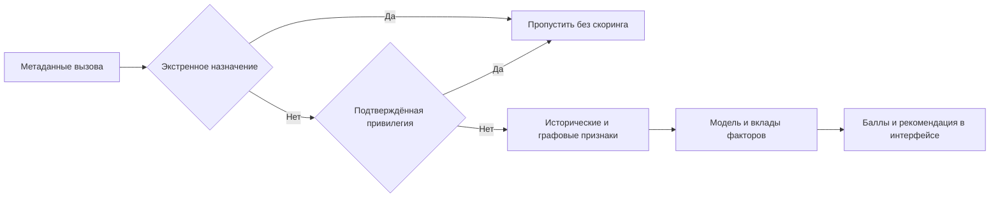

# Стратегия антифрода по метаданным

## Что делает прототип

Прототип решает кейс Nexign «Антифрод без прослушки»: оценивает звонок и поведение номера, объясняет результат и помогает оператору выбрать вызовы для проверки. Ни аудио, ни расшифровки не используются. Главный критерий качества — доля ложных тревог на легитимных звонках.

Это локальное хакатонное демо. В нём нет API-ключей, учётных записей, ролевых проверок, административного согласования и журнала аудита. В интерфейсе доступны оценка, готовые примеры и добавление с отзывом привилегированных номеров. Проверка источника звонка остаётся частью предметной логики, чтобы подмена номера не превращалась в привилегию.

## Стек и путь данных

Python обрабатывает метаданные, scikit-learn рассчитывает модель, NetworkX строит графовые признаки, FastAPI обслуживает API и визуальную страницу. HTML, CSS и JavaScript работают без дополнительных библиотек и сборки. SQLite хранит историю и реестр.

Индекс риска и действие с вызовом разделены. Высокий балл означает рекомендацию проверки, а не автоматическую блокировку. В текущем коде `auto_block` всегда равен `false`. Приложение не подключается к телефонной сети и не прекращает соединения.

## Данные без подглядывания в будущее

В момент начала вызова доступны номера, время, страна и оператор источника, транк, псевдоним абонента, регион назначения, тип соединения, подтверждение источника и экстренное назначение. Длительность ещё неизвестна и не поступает в запрос скоринга текущего вызова.

Длительность и результат используются только из завершённой истории, полученной до момента оценки. Запоздалые записи не включаются в прошлый снимок. Основное окно — 24 часа, для интенсивности отдельно выделяется последний час. История привязывается к текущему абоненту номера, чтобы после переоформления не переносить репутацию прежнего владельца автоматически.

Номер нормализуется точно, без совпадения по суффиксу. Неизвестный номер или менее пяти завершённых вызовов дают `insufficient_data` и отсутствие балла. Это недостаток данных, а не доказательство безопасности.

## Признаки

| Группа | Признаки |
| --- | --- |
| Интенсивность | Вызовы за час, уникальные адресаты, количество регионов |
| Результат соединений | Доли коротких отвеченных, неотвеченных и завершившихся за секунду |
| Контакты | Средняя длительность, доля повторных адресатов |
| Граф | Число номеров одного абонента, сходство веерного обзвона |
| Контекст | Вход из-за рубежа, VoIP, подтверждение источника, время UTC |

Граф связывает абонента с номерами, а номера — с адресатами. Веер требует минимум трёх номеров с пятью вызовами на каждом, общим часовым интервалом, похожими длительностями и почти непересекающимися списками адресатов. Это только признак: легитимная больница или колл-центр тоже могут массово звонить. Такие случаи обязательно присутствуют в синтетике.

Веер пока ищется внутри одного известного абонента. Межоператорские кампании и связи между разными абонентами не реализованы. Международное происхождение само по себе не определяет мошенничество.

## Балл и объяснение

Используется логистическая регрессия со стандартизацией. Для каждого признака рассчитывается вклад `c_i = coefficient_i × (value_i − mean_i) / scale_i`, затем `z = intercept + sum(c_i)` и `risk_score = 100 × sigmoid(z)`.

Интерфейс показывает общий балл, порог, исторические показатели и полосы факторов. Красные повышают оценку, синие снижают. Все 15 вкладов доступны по кнопке раскрытия. Сумма вкладов и базового уровня точно восстанавливает выход модели. Экспорт параметров проверен против scikit-learn с допуском `1e-10`.

Вклад выражается в логарифме отношения шансов, а не в баллах шкалы 0–100. Поэтому интерфейс не утверждает, что отдельная полоса добавила, например, 38 баллов. Модель обучена на синтетике с весами классов; индекс риска нельзя выдавать за проверенную вероятность мошенничества в реальной сети.

Порог рекомендации выбран на валидации с целью максимизировать полноту при FPR не выше 1%. Текущий порог — около 69,47 из 100. Сравнение происходит до округления отображаемого балла.

## Вопрос в ТЗ о скорой помощи

**Что произойдёт, если ваша система заблокирует вызов скорой помощи?**

Это критическая ошибка. Требование к решению — доступ к экстренной службе независимо от оценки источника. Даже высокий риск вызывающего номера не должен препятствовать обращению за помощью.

В демо точные назначения 101, 102, 103, 104 и 112, а также `destination_service: emergency` проходят без обращения к модели, истории и реестру. Код проверяет это первым. Номер, который просто заканчивается на 103, не получает исключение. Привилегия назначения не делает звонящего привилегированным при вызовах другим людям.

Отдельные тесты подставляют одновременно недоступные модель и БД и проверяют, что экстренный вызов всё равно получает `allow`. Для реального оператора независимый обход должен находиться в маршрутизации до обращения к API; текущий прототип эту сетевую интеграцию не реализует.

Если ошибка блокировки всё-таки возникла в интегрированной системе, необходимо немедленно отключить блокирующее правило, восстановить экстренный маршрут, проверить обычные и обратные вызовы скорой помощи и добавить регрессионный тест на причину сбоя. Высокий балл модели не является оправданием блокировки.

## Привилегированные номера организаций

Идея реестра реализована в отдельной вкладке. В демонстрации пользователь указывает организацию и известный номер, а приложение сразу добавляет привилегию на 30 дней. Отдельного согласования и секрета администратора нет. При добавлении берутся атрибуты последнего подтверждённого источника из истории. Номер без истории или с неподтверждённым последним источником добавить нельзя.

Для привилегированного вызова одновременно должны совпасть номер, подтверждение источника, идентификатор абонента, оператор и транк. Это позволяет показать разницу между обратным звонком больницы и подменой её Caller ID. Срок действия и отзыв также учитываются. Отзыв применяется немедленно.

Проверку документов организации в демо заменяет локальное добавление из известных данных. Это не утверждение о реальной проверке юридического лица. В интерфейсе уже есть синтетическая больница, чтобы можно было сразу попробовать обратный звонок, подмену и отзыв привилегии.

Привилегия относится к исходящим звонкам организации и не присваивает номеру нулевой риск. Вызов пропускается по отдельному правилу; сам номер по-прежнему можно оценить через поиск. Произвольный входящий звонок на длинный номер больницы не приравнивается автоматически к экстренному направлению.

## Решения

| Условие | Результат |
| --- | --- |
| Экстренное назначение | Пропустить без ожидания скоринга |
| Действующая привилегия и подтверждённый источник | Пропустить |
| Нет достаточной истории | Пропустить без балла, сообщить о нехватке данных |
| Ошибка модели или истории | Пропустить без балла, показать недоступность оценки |
| Балл ниже порога | Пропустить |
| Балл достигает порога | Рекомендовать проверку, не прерывая соединение |

## Данные и измеренные результаты

С seed 42 подготовлено 155 967 завершённых вызовов и 1400 запросов оценки. Включены личные контакты, курьер, больница, колл-центр, международные семейные контакты, малый бизнес, короткие легитимные звонки, сервисные уведомления, массовое мошенничество, короткие провокационные звонки, веер и малозаметное мошенничество.

Разделение: 600 примеров обучения, 400 валидации и 400 теста. Абоненты, номера, адресаты и временные периоды между частями не пересекаются. Метки и названия сценариев не входят в модель. Сырые записи, признаки и разметка находятся в отдельных JSONL-файлах.

| Выборка | Ложные тревоги | Пропуски мошеннических примеров | FPR | Полнота |
| --- | --- | --- | --- | --- |
| Валидация | 2 из 268 легитимных | 13 из 132 | 0,75% | 90,15% |
| Отложенный тест | 4 из 268 легитимных | 10 из 132 | 1,49% | 92,42% |

Цель FPR 1% на тесте не достигнута. Верхняя граница 95-процентного интервала Wilson составляет около 3,77%. После просмотра теста порог не подгонялся. Ложные тревоги: один курьер, два международных семейных примера и одно сервисное уведомление. Все десять пропусков относятся к малозаметному мошенничеству.

Это проверка конвейера на синтетике, а не доказательство качества на закрытом наборе организаторов или реальных абонентах. Следующий содержательный шаг — независимая оценка на размеченных операторских данных, особенно на массовых легитимных звонках и малозаметном мошенничестве.

## Приёмка демо

- Главная страница открывается одной командой и не запрашивает ключей.
- Готовые сценарии реально вызывают модель и показывают её ответы.
- Неизвестный номер получает отсутствие оценки, а не нулевой риск.
- Все вклады вместе с базой воспроизводят итог модели.
- Экстренный вызов проходит при отказах модели и БД.
- Подмена Caller ID не получает привилегию больницы.
- Добавление, истечение срока и отзыв привилегии меняют поведение вызова.
- Будущие и ещё не полученные записи не попадают в исторические признаки.
- Наборы обучения, валидации и теста разделены по абонентам и времени.

## Технические источники

[LogisticRegression scikit-learn](https://scikit-learn.org/stable/modules/generated/sklearn.linear_model.LogisticRegression.html) описывает коэффициенты модели; [NetworkX](https://networkx.org/documentation/stable/reference/classes/generated/networkx.Graph.neighbors.html) — обход связей; [FastAPI](https://fastapi.tiangolo.com/tutorial/testing/) — тестирование API. Эти источники подтверждают способы работы библиотек, а не качество самого антифрода.
